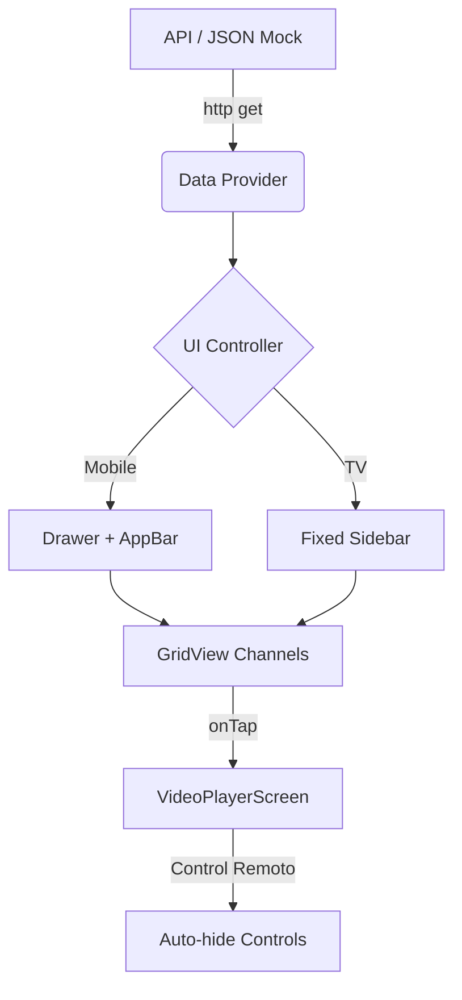

# 📺 Google TV Flutter App - Proyecto Inicial

Este proyecto es una aplicación de Flutter optimizada para **Google TV** y **Android TV**. Permite la visualización de canales en vivo a través de listas dinámicas consumidas desde una API, con soporte completo para navegación por control remoto (D-pad) y diseño responsive.

## 🚀 Características Principales

*   **Optimización TV:** Configuración nativa para Leanback Launcher y navegación horizontal.
*   **Manejo de Foco:** Sistema de navegación amigable para controles remotos con efectos visuales de selección.
*   **Reproductor de Video:** Integración con `video_player` para soporte de streams `.m3u8`.
*   **API Dinámica:** Consumo de datos con autenticación `x-api-key`.
*   **Logos Locales + Fallback:** Sistema inteligente que prioriza logos en la carpeta `assets/` y descarga de internet si no existen.
*   **Diseño Responsive:** Se adapta automáticamente a celulares y tablets (menú hamburguesa vs barra lateral fija).

---

## 🏗️ Arquitectura del Proyecto



---

## 📁 Estructura de Archivos Clave

*   `lib/main.dart`: Contiene toda la lógica de la aplicación, manejo de estados, UI responsive y el reproductor de video.
*   `android/app/src/main/AndroidManifest.xml`: Configuración crítica para que la app sea instalada en el "Home" de la televisión.
*   `assets/logos/`: Carpeta donde debes colocar los logos de los canales en formato `.png`.
*   `pubspec.yaml`: Registro de dependencias (`video_player`, `http`) y carpetas de activos.

---

## 🛠️ Cómo agregar nuevos canales

Para que un canal aparezca en la app, debe estar en el JSON de la API con la siguiente estructura:

```json
{
  "title": "NOMBRE DEL CANAL",
  "logo": "nombre_archivo.png",
  "sources": [
    {
      "id": 1,
      "link": "https://servidor.com/stream.m3u8"
    }
  ]
}
```

### Gestión de Logos:
1.  Descarga el logo y guárdalo en `assets/logos/`.
2.  El nombre del archivo debe coincidir exactamente con lo que pongas en el campo `"logo"` del JSON.

---

## 🕹️ Comandos Útiles

### Ejecución en Desarrollo:
```powershell
flutter run
```

### Generar instalador (APK):
```powershell
flutter build apk --release
```
*El archivo resultante estará en `build\app\outputs\flutter-apk\app-release.apk`*

---

## 📺 Notas para Android TV

*   **Navegación:** La app usa el sistema de foco nativo de Flutter. Cualquier widget `InkWell` o `Button` es navegable con las flechas del control.
*   **Controles del Video:** Aparecen al tocar cualquier tecla y se ocultan tras 4 segundos de inactividad.
*   **Versión Mínima:** Android 5.0 (API 21).

---

## 🔐 Seguridad API
La app envía automáticamente la cabecera de seguridad para tu servidor en Render:
*   **Header:** `x-api-key`
*   **Valor:** `Adm1n1str4`

---
> [!TIP]
> Si añades logos nuevos a la carpeta `assets`, detén la ejecución de la app (`q`) y vuelve a lanzarla con `flutter run` para que los nuevos archivos se incluyan en el paquete.
